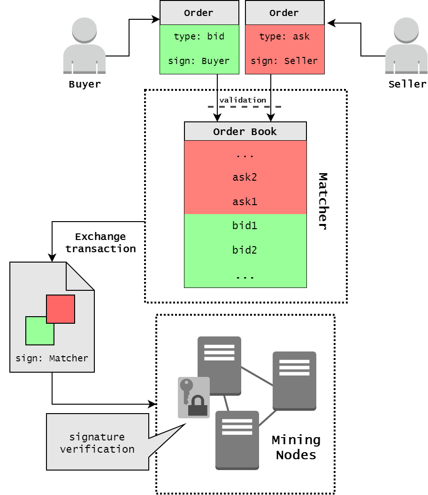

# Decentralized cryptocurrency exchange (DEX)
**Motivation**

The need to convert and exchange between crypto tokens is increasing with the enlargement of cryptocurrencies number. One of the main features of the blockchain environment is decentralization, but until recently only centralized exchanges existed, even for cryptocurrencies such as Bitcoin or Ethereum. Many exchanges support the buy and sale of cryptocurrencies, fiat currencies, and cryptocurrency tokens. Examples of such centralized exchanges are Coinbase, BTC-e, ShapeShift and Mt.Gox. The centralization experience in this sphere are lamentable, cause of a single point of failure - the exchange. In this case all users funds should be kept at one place for participation in trade. The users funds are stored directly in the exchange, and it is responsible not only for matching orders and keep the current order book in the correct state, but also for depositors' funds. The Mt.Gox collapse is the brightest example of why it is not reliable, the resulting loss after compromised it was about 650,000 BTC. Someone can hack into exchange system and all users will lost everything, cause their private keys is kept all together, like in one of version BTC-e fund's theft. And these are not the only exchanges that have lost the funds of depositors in this way. The use of a decentralized approach in the entity of an exchange helps to avoid the involvement of many users assets into problems caused by the danger of frontrunning by intruders into the work of exchange.

**Decentralized Exchange**

The decentralize exchanges do not require users to trust them with their money: user's wallet do not controlled by a single entity. Orders are digitally signed directly by owners, as an authorization process. Users control their funds, but on-chain trading have the side effect of not real-time trading as at a centralized exchange.

Decentralized exchanges have some advantages over centralized, but also drawbacks.

If all components of exchange are decentralized there is no automatic matching of buy and sell orders, this operation also should be done by users. For example for specific order, which is validated and put in order book, any other user can add a digitally signed counterorder and send the complete transaction with pair of orders to the blockchain. Then the assets are transferred between the buyer and seller.

Due to decentralized nature of matching, for signed order's cancellation should be created an individual on-chain transaction, and users unable to quickly cancel their orders in response to market fluctuations. The user should pay fee for transaction's cancellation, and this is the point when an arbitrageur may intervene, pay a higher fee and race against the cancellation transaction.

Also with such lack of automatic matching and fast cancellation, there is vulnerability to miner front-running. The miner of the next block will always have the option to execute cancelled orders with themselves as the counterparty, potentially profiting from such an order.

What if we decentralize not all component of exchange, but only the matcher part? This design eliminates two of the described problems above: the arbitrageur with already cancelled orders, and miners front-running. Unlike centralized exchanges, the decentralized solution with centralized matcher won’t have the power to steal users’ deposits.

**Waves DEX**

Waves provides a decentralized exchange (DEX), which allows to trade different assets back and forth between users, as a traditional exchange, with stronger security guarantees to end users due to its decentralized nature. An opportunity of creation some new assets, based on Waves, allows early trading of a crowdfunding stake, that provides liquidity for tokens. For this purpose tokens should be sold in public locations, where buyers and sellers may post orders.

The real-time trading is achieved thanks to the only centralized design element of our DEX - the order book Matcher, which matches incoming orders and execute trades at high speed, typically within milliseconds. There is no need to wait for the next block to know whether a trade has been executed successfully, this provides speed at the level of centralized exchange and the security of decentralized protocol.

The orders are linked in pairs by individual nodes, which work as Matcher. Before getting into Waves blockchain, exchange transactions are always checked by the nodes for matching the prices in orders so that the matcher can not implement the "wrong" transactions.Then the Matcher create Exchange Transaction, signs it with its signature and put it into blockchain for to fix changes in balances of users. The Matcher also can match orders partially, as at ordinal exchange. After the transaction is confirmed, Matcher's sign is validate by mining nodes and exchange transaction put into blockchain, user account balances of assets are changed according to amount and order execution price. The important point is that the funds are transferred only after publishing in the blockchain. If the Matcher fails, the exchange will not take place, but the funds will not be lost, cause exchange does not own client's assets.

A user initiates his willingness to purchase or sale assets by creating, signing and sending a Limit Order request to the Matcher node. The Limit Order here is the same as at all exchanges: an order for a buy (sell) of fixed number of token at a price equal or better than specified.When a new Order is submitted to the DEX all its fields are checked for adequacy and a signature is validated by sender's public key. Then, the Order is validated, based on internal Matcher state: Order with such id should not exist already and sum of all Order amounts for a particular asset should be less or equal to balance of that asset on sender's account. The scheme of work with the DEX is shown in the Figure 1:

Figure 1

User can set an expiration time (maximum timestamp) to the order, and when the order expires it will be automatically canceled. One of the rules at DEX is that all orders older than 30 days will be canceled by default. An expiration time for each order is specified by the user at the time the order is signed. The expiration time is a long integer value that represents the absolute number of seconds since the unix epoch. When order is unfilled and its expiration time is more than now unix timestamp, it can be canceled by user. In this case the order get into blockchain as Cancelled order and nobody can fill it sinse that.

The full execution cycle for one order is following:

1. If for a submitted order there is no counter-order matched by price, then order would be put in the corresponding order book.

2. If there is a counter-order that matches with the submitted order, then the order execution is performed. That means the counter-order is removed from order book and the matcher creates exchange transaction, signs it by matcher's private key and is sent to the Waves network for including in the blockchain.

3. If an amount of a submitted order is a big enough to execute a few order, Matcher creates several transaction. Created transactions have amounts equal to matched counter-order amounts. Matched counter-orders are chosen in order of their acceptance time (First In, First Out).

In every time of order's life it has a certain state, depending on which stage of its life cycle it is now. When order is in order book, but not filled yet - it has "Accepted" state, also it can be "Filled", "Partially Filled" or "Canceled". Orders, which are not fully filled, can be canceled, after that the order will be removed from matcher's order book.
